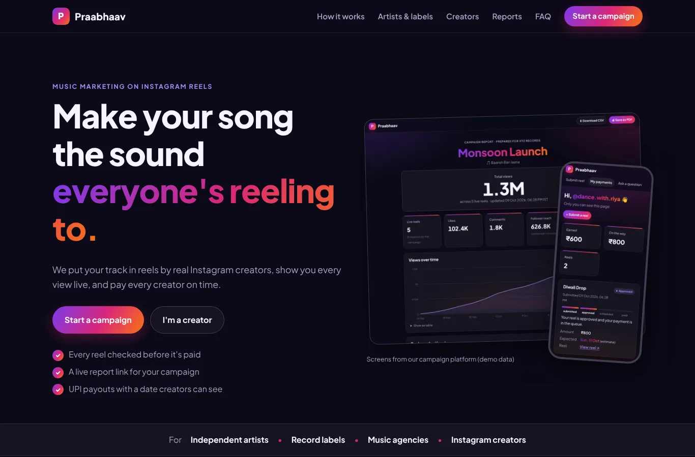

# Praabhaav website

The public website for Praabhaav: what we do, how campaigns work, sections for artists/labels and creators, client reports, FAQ, and a contact form. It's plain HTML/CSS/JS with no build step, ready for Netlify.



## Before going live: fill in your details

In `index.html`, search for `YOUR_HANDLE` and `91XXXXXXXXXX`:

- `https://www.instagram.com/YOUR_HANDLE/` and `@YOUR_HANDLE` → Praabhaav's Instagram
- `https://wa.me/91XXXXXXXXXX` → your WhatsApp number with country code, no spaces or `+` (e.g. `919876543210`)

Also check the FAQ answers match how you actually work.

## Publish on Netlify (free, about 5 minutes)

1. netlify.com → **Add new site → Import an existing project → GitHub** → pick the **Claude** repo.
2. Settings:
   - **Branch:** the branch that has this folder
   - **Base directory:** `praabhaav-site`
   - **Build command:** leave empty
   - **Publish directory:** `praabhaav-site` (Netlify fills this in from the base directory)
3. **Deploy**. You get a URL like `praabhaav.netlify.app`; rename it under **Site configuration → Change site name**.

**Quicker option, without GitHub:** app.netlify.com/drop → drag the `praabhaav-site` folder onto the page.

## Contact form submissions

The form uses **Netlify Forms** (free tier: 100 submissions a month). After the first deploy:

1. Netlify → your site → **Forms** → enable form detection if asked, then redeploy once.
2. Submissions appear under **Forms → contact**.
3. **Forms → Form notifications → Add notification → Email** to get each enquiry by email.

Spam is filtered by a hidden honeypot field. Forms only work on the Netlify-hosted site, not when opening the file locally.

## Files

```
index.html     the page
style.css      theme (same colours as the app; follows the device's light/dark setting)
script.js      mobile menu, scroll animations, contact form artist/creator toggle
thanks.html    shown after the form is sent
netlify.toml   Netlify settings and security headers
assets/        logo and app screenshots (demo data)
```

To preview locally: `cd praabhaav-site && python -m http.server 8000`, then open http://localhost:8000.
