# Praabhaav

An operations app for Praabhaav, a music marketing company. Clients (artists, labels, agencies) give Praabhaav a song; Praabhaav pays Instagram creators over UPI to post reels on it.

The app replaces the per-campaign Google Sheets and the "where's my payment?" WhatsApp threads:

- **Campaign tracker:** one page per campaign with every creator's profile, followers, post link, price per reel and live reel link. **Live views** and **follower counts** come from Instagram via Apify, with totals and cost per 1,000 views.
- **Client report links** (`/r/<secret>`):
- On a campaign's page: **Create client report link** → **Copy link** → send it to the artist/label. **New link** replaces it (the old one stops working); **Turn off** disables it.
- Shows campaign and song, total views (headline), live reels, likes, comments, follower reach, average views per reel, and every live reel ranked by views with a **Watch** link. Numbers update with the daily views refresh.
- **Never shows** prices, spend, cost per view, notes, creator phone numbers or UPI IDs. Reels Apify reports as deleted/private are left off until fixed.
- Clients can **Download CSV** or **Save as PDF** (clean light layout for printing). The page tells search engines not to index it and doesn't leak its link to other sites.

**Creator payments:** creators submit their reel and UPI ID. Reels are **checked automatically** (live? right creator? right song?), and payouts are **planned around the daily UPI limit**, so every creator sees an expected payment date.
- **Two separate logins:** **hosts** (the team) see everything; **creators** log in with a PIN and see only their own reels, payments and questions.
- **Client report links:** a live, read-only page per campaign for the artist or label (views, likes, reach, every live reel ranked), with no login, shareable with one link, and downloadable as PDF or CSV.
- **Query agent:** a Claude-powered assistant answers creator and client questions and escalates anything that needs a human to the team on Telegram.

| Campaign tracker | Creator dashboard (phone) | Campaigns |
|---|---|---|
| 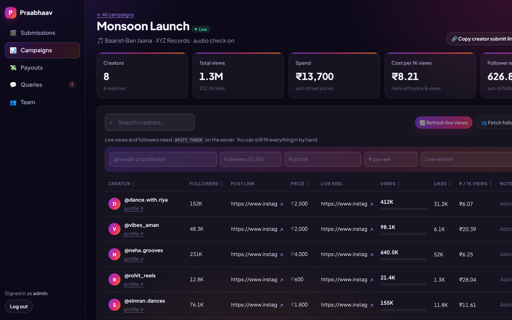 | 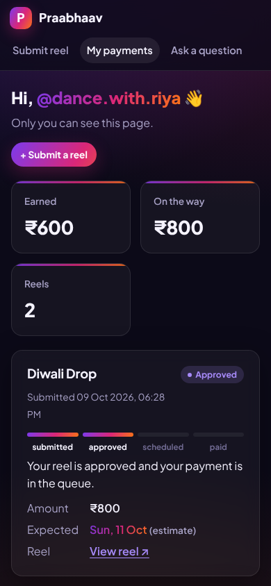 | 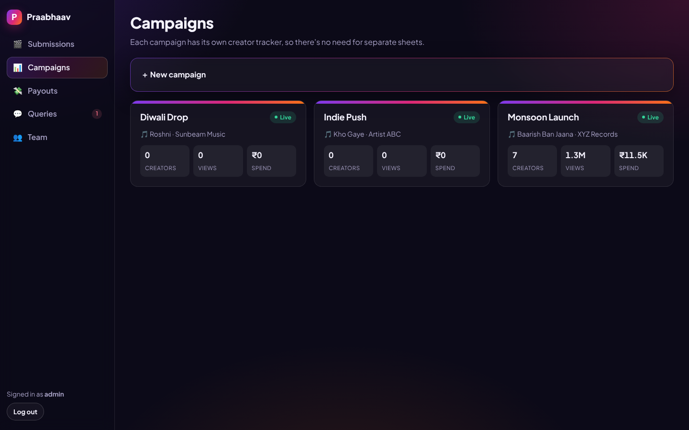 |

| Submissions & reel checks | Payment planner | Light theme |
|---|---|---|
| 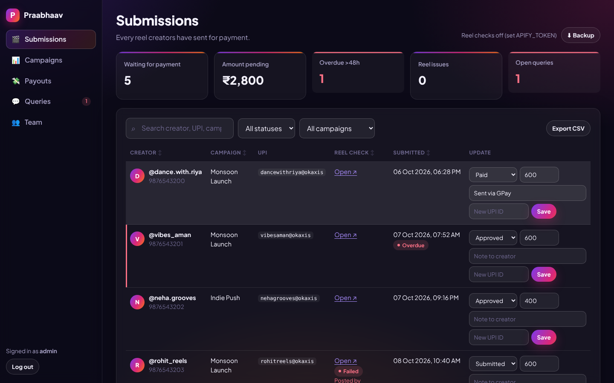 | 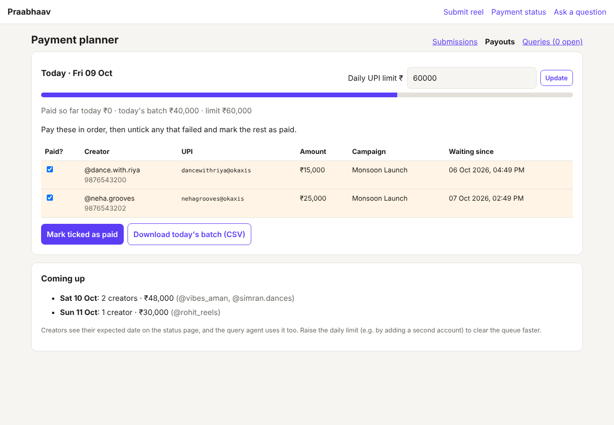 | 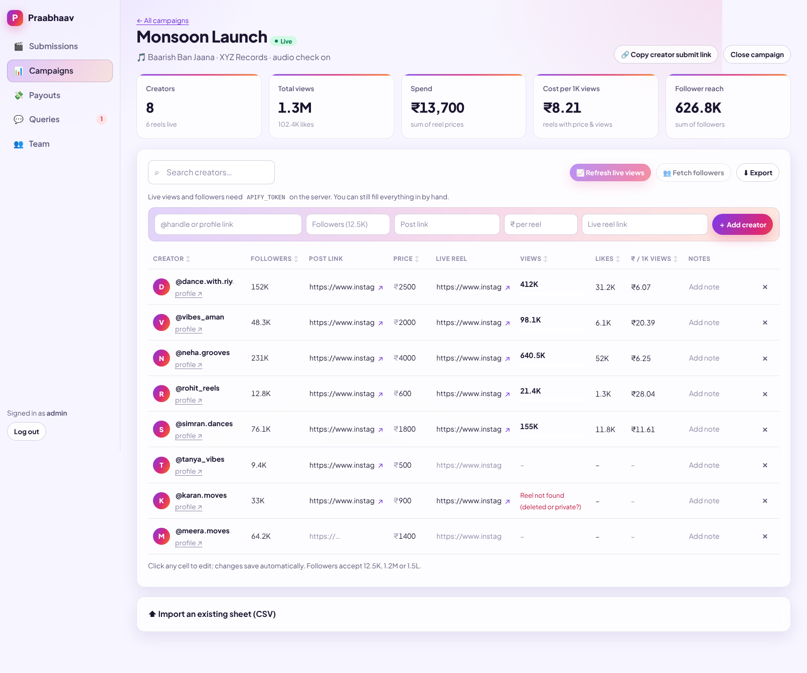 |

| Client report | Client report (phone) | |
|---|---|---|
| 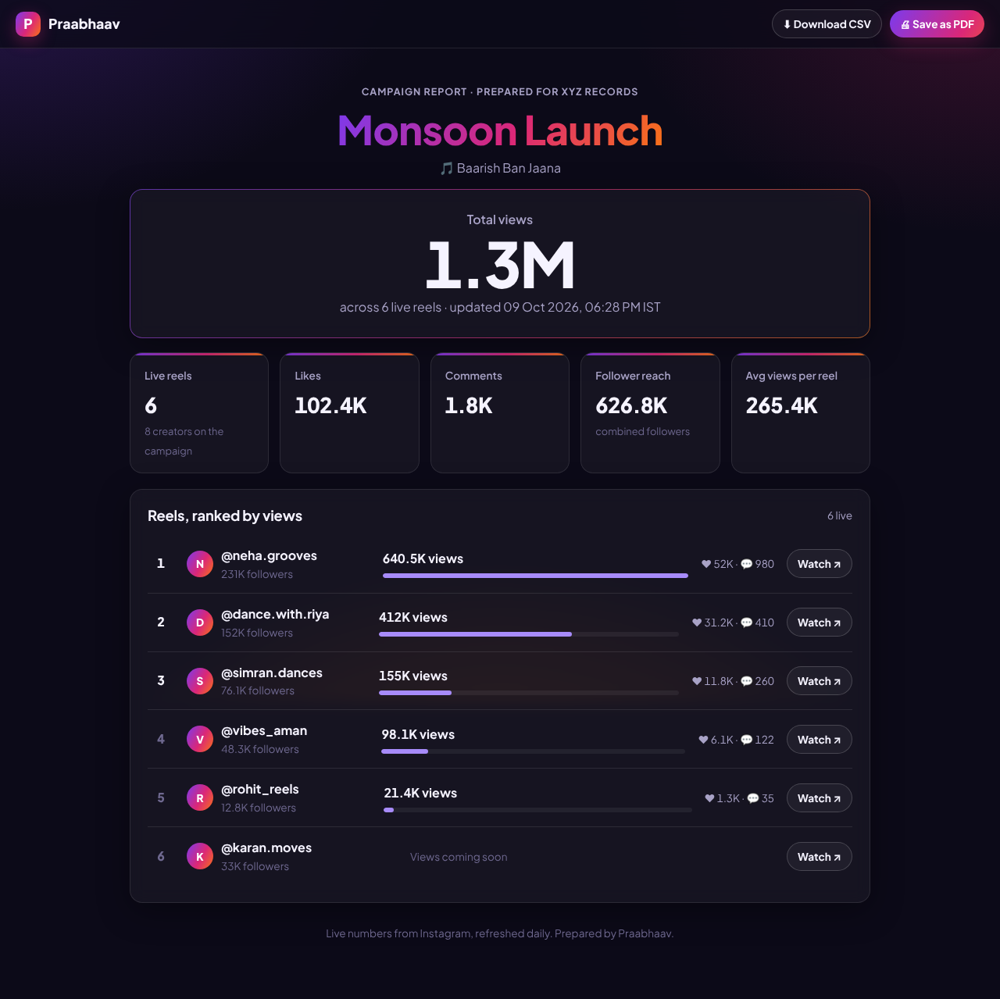 | 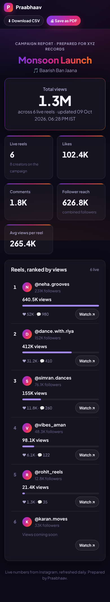 | |

| Home (phone) | Submit a reel (phone) | Tracker (phone) |
|---|---|---|
| 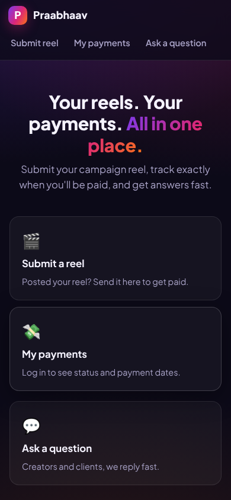 | 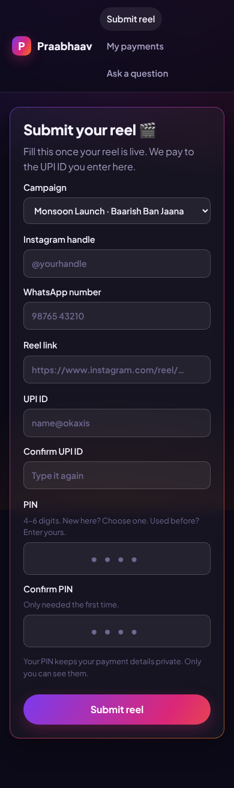 | 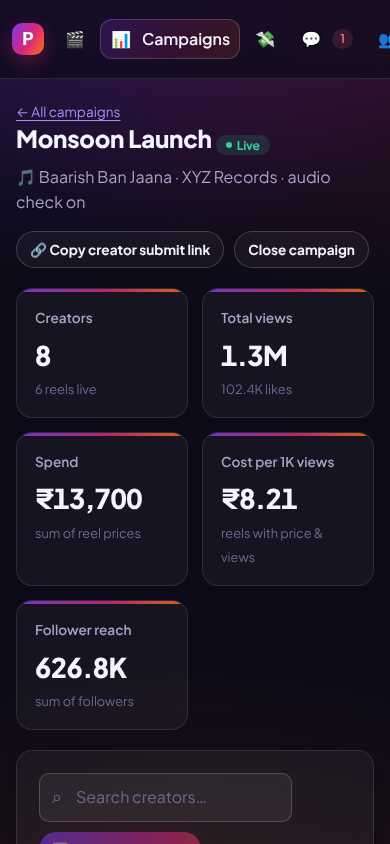 |

## Who sees what

| | Hosts (team) | Creators | Clients |
|---|---|---|---|
| Log in at | `/login` (username + password) | `/me` (Instagram handle + WhatsApp number + PIN) | no login; secret report link |
| Campaign trackers, all submissions, payouts, queries | ✅ | ❌ | ❌ |
| Their own reels, payment status, expected dates, questions | ✅ | ✅ only their own | ❌ |
| Ask a question | n/a | ✅ answered from their own records | ✅ always goes to the team |
| Campaign report: views, likes, reach, live reels | ✅ | ❌ | ✅ only via the link you send, never prices or spend |

- **Host accounts:** the owner account is `ADMIN_USER` / `ADMIN_PASSWORD` from the server settings. The owner adds and removes team members on **Team**; removing someone ends their access immediately.
- **Creator PINs:** creators choose a 4–6 digit PIN the first time they submit. Creators who submitted before PINs existed are asked to set one at their first login.
- **Security:** passwords and PINs are stored as salted PBKDF2 hashes. Sessions are signed, HttpOnly, SameSite=Lax cookies. Five wrong attempts lock that login for 15 minutes. A logged-in creator always submits and asks as themselves, whatever the form says.

## Features

**Campaign tracker** (`/admin/campaigns/<id>`):
- Add creators with an `@handle` or profile link, followers (`12.5K`, `1.2M` and `1.5L` all work), post link, ₹ per reel and live reel link.
- **Click any cell to edit**; changes save automatically and the totals update immediately. Live search and sortable columns are included.
- **Refresh live views** (Apify Reel Scraper) and **Fetch followers** (Apify Profile Scraper) run in the background with progress shown. Views also refresh automatically **once a day at 08:30 IST** for active campaigns.
- Totals: creators, live reels, total views and likes, spend, **cost per 1,000 views**, follower reach. Each row shows its views as a bar relative to the campaign's best reel.
- **Import your existing sheets:** Google Sheets → File → Download → CSV, then upload. Columns are matched by name. **Export** to CSV anytime.

**Client report links** (`/r/<secret>`):
- On a campaign's page: **Create client report link** → **Copy link** → send it to the artist/label. **New link** replaces it (the old one stops working); **Turn off** disables it.
- Shows campaign and song, total views (headline), live reels, likes, comments, follower reach, average views per reel, and every live reel ranked by views with a **Watch** link. Numbers update with the daily views refresh.
- **Never shows** prices, spend, cost per view, notes, creator phone numbers or UPI IDs. Reels Apify reports as deleted/private are left off until fixed.
- Clients can **Download CSV** or **Save as PDF** (clean light layout for printing). The page tells search engines not to index it and doesn't leak its link to other sites.

**Creator payments:**
- `/submit?campaign=<id>`: reel link, handle, WhatsApp, UPI ID (entered twice) and PIN. Send the link (**Copy creator submit link** on the campaign page) on WhatsApp.
- **Reel checks** ([`app/reels.py`](app/reels.py)): the reel exists, it was posted by the creator who submitted it, and it uses the campaign audio. Passing reels are approved automatically; failing ones are flagged with reasons, **never auto-rejected**.
- **Payment planner** (`/admin/payouts`): strictly oldest-first within the daily UPI limit. You get today's batch with copyable UPI IDs, **Mark ticked as paid**, and a CSV. Creators see the expected date.

**Query agent** (`/query`):
- Claude sees **only the logged-in creator's own records** plus [`app/knowledge/faq.md`](app/knowledge/faq.md). Logged-out questions are treated as client questions and never receive creator data.
- Fixed escalation rules in code: client queries, UPI changes, amount disputes and overdue payments always go to a human. The team gets Telegram alerts and a 09:30 IST daily summary.
- Works without keys: no `ANTHROPIC_API_KEY` → keyword rules; no Telegram → alerts go to the server log; no `APIFY_TOKEN` → the tracker still works, just without live stats.

**Interface:** a vibrant dark theme (with an automatic light theme when the device prefers light mode), built for phones first: count-up stats, toasts, copy buttons, live search and sort, inline editing. No build step; it's plain HTML, CSS and a small [`app.js`](app/static/app.js).

## Deploy

See **[DEPLOY.md](DEPLOY.md)**: Render (Singapore) with a persistent disk, about $7.25/month.

## Run it locally

```bash
cd praabhaav
python -m venv .venv && source .venv/bin/activate
pip install -r requirements-dev.txt

export ADMIN_PASSWORD=change-me      # owner login (username "admin" unless ADMIN_USER is set)
export SECRET_KEY=any-long-random-string   # keeps logins valid across restarts
export ANTHROPIC_API_KEY=...         # optional: Claude query agent
export TELEGRAM_BOT_TOKEN=...        # optional: alerts + daily summary
export TELEGRAM_CHAT_ID=...
export APIFY_TOKEN=...               # optional: reel checks, live views, followers
export ENABLE_SCHEDULER=1            # optional: run scheduled jobs inside the app

uvicorn app.main:create_app --factory --reload
```

Open http://localhost:8000/login and log in as `admin`. All settings are listed in [`.env.example`](.env.example).

- **Telegram:** message [@BotFather](https://t.me/BotFather), send `/newbot`, and copy the token. Send your bot a message, then open `https://api.telegram.org/bot<TOKEN>/getUpdates` and copy `chat.id`.
- **Apify:** apify.com → Settings → API & Integrations. Roughly $0.003 per reel or profile fetched (check Apify's pricing for your plan).
- **Tests:** `python -m pytest -q`

## Project layout

```
app/
  main.py            app setup: context, login redirect, scheduler, route registration
  web.py             shared context, sessions, host/creator access checks, template filters
  auth.py            password/PIN hashing, signed session cookies, lockout settings
  routes_creator.py  home, reel submission, creator login + dashboard, questions
  routes_admin.py    host login, team, submissions, payouts, queries, exports, backup
  routes_tracker.py  campaigns + per-campaign tracker pages and their JSON API
  tracker.py         tracker parsing, totals, CSV import/export, Apify refresh jobs
  db.py              SQLite schema, migrations and queries
  agent.py           query agent: Claude call, fallback rules, escalation policy
  reels.py           Apify client + automatic reel checks
  planner.py         payout planner (daily UPI limit, oldest-first)
  scheduler.py       in-app jobs: reel checks, daily views, daily summary
  notify.py, digest.py   Telegram alerts and the daily summary
  validation.py      phone, UPI, handle, reel link, PIN validation
  knowledge/faq.md   what the agent may tell people (edit this)
  templates/, static/  pages, theme (style.css), interactivity (app.js)
tests/               pytest suite
```

## Before using with real creators

- Deploy behind **HTTPS** (see [DEPLOY.md](DEPLOY.md)). UPI IDs and phone numbers are personal data.
- Use a long random `ADMIN_PASSWORD` and set `SECRET_KEY`.
- Download a backup from **Submissions → Backup** at least weekly.
- Edit `app/knowledge/faq.md` so it states your real payment policy.
- **Forgotten PINs:** the creator asks the team; a host clicks **Reset PIN** under their name on Submissions, and the creator chooses a new PIN at next login. Only reset after confirming it's really them, e.g. by replying from their WhatsApp number.
- The query form has no rate limit or captcha yet; add one if spam shows up.

## Roadmap

1. Tracker, submission form, status page ✅
2. Query agent, Telegram escalation, daily summary ✅
3. Reel verification, payment planner ✅
4. Host/creator logins, campaign tracker with live views, new interface ✅
5. Client report links ✅
6. **Payout API:** pay today's batch through RazorpayX / Cashfree Payouts, removing the daily UPI limit problem at the source.
7. **Chat front-ends:** WhatsApp / Instagram DM bot on the same backend.
