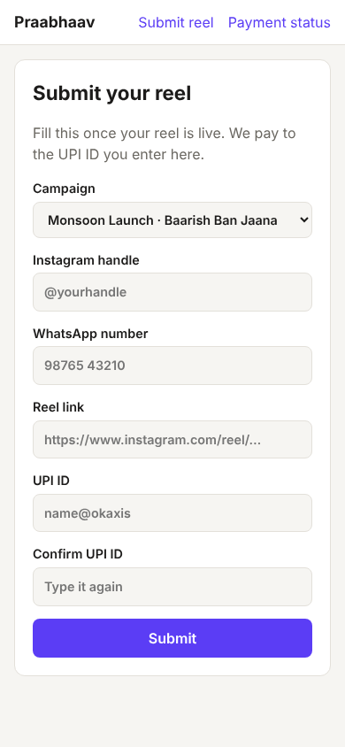
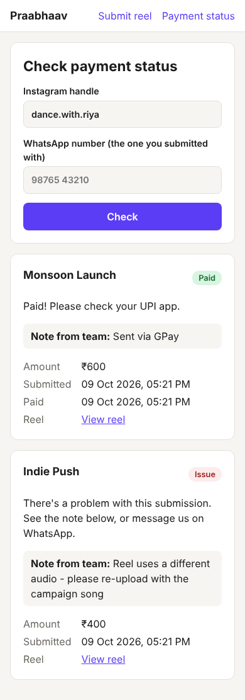
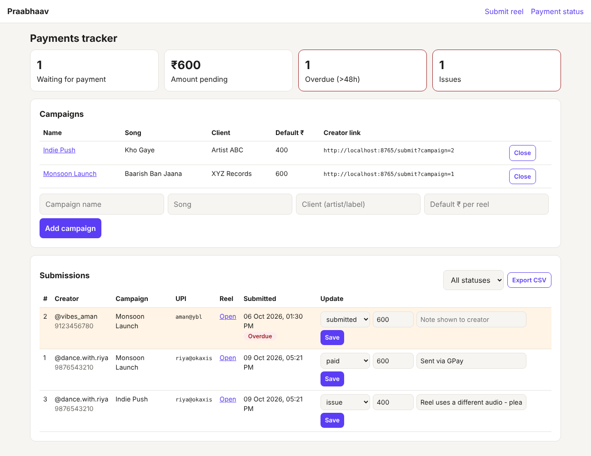

# Praabhaav Creator Payments

A payment tracker for Praabhaav, a music marketing company. Creators post reels on a client's song and get paid over UPI. This app is the single place where every creator, reel and payment is recorded, so the team knows who is owed what and creators can check their own payment status instead of messaging about it.

**Phase 1 of a larger plan.** Later phases add an AI query agent, Telegram alerts, automatic reel verification and a payment planner. See [Roadmap](#roadmap).

| Creator: submit reel | Creator: check status | Team: payments tracker |
|---|---|---|
|  |  |  |

## What it does

**For creators (mobile-first, no login):**
- `/submit?campaign=<id>`: submit a reel link, Instagram handle, WhatsApp number and UPI ID (entered twice to catch typos). Send this link on WhatsApp once a creator agrees to a campaign.
- `/status`: enter IG handle + WhatsApp number to see status, amount and any note from the team. Both must match, so nobody can look up someone else's payments.

**For the team (`/admin`, password protected):**
- Create campaigns with a default ₹ per reel; close them when done.
- See every submission with status `submitted → approved → scheduled → paid` (or `issue`).
- Change status, adjust the amount per creator, and leave a note that the creator sees.
- Dashboard: number waiting for payment, ₹ pending, **overdue (>48h)** and issues. Overdue rows are highlighted.
- **Export CSV** (e.g. all `approved`) to pay in bulk or upload to a payout tool.

**Validation built in:** Indian mobile numbers (accepts `+91`, spaces, leading 0), UPI ID format, Instagram reel links (tracking params stripped), and one submission per creator per campaign.

## Run it locally

```bash
cd praabhaav
python -m venv .venv && source .venv/bin/activate
pip install -r requirements-dev.txt

export ADMIN_PASSWORD=change-me      # admin is disabled until this is set
export ADMIN_USER=admin              # optional, defaults to "admin"
export PRAABHAAV_DB=praabhaav.db     # optional, SQLite file path

uvicorn app.main:create_app --factory --reload
```

Open http://localhost:8000/admin, create a campaign, then copy its creator link.

Run tests:

```bash
python -m pytest -q
```

## Project layout

```
app/
  main.py         routes: creator pages, admin, CSV export
  db.py           SQLite schema and queries (the single source of truth)
  validation.py   cleaning/validation of phone, UPI, IG handle, reel URL
  templates/      Jinja2 HTML pages
  static/         CSS
tests/            pytest suite
```

## Before using with real creators

- Deploy behind **HTTPS** (e.g. Render, Railway, or a small VPS with Caddy). UPI IDs and phone numbers are personal data.
- Use a long random `ADMIN_PASSWORD`.
- Back up the `.db` file regularly (or move to Postgres / Google Sheets sync in Phase 2).
- Admin uses HTTP Basic auth and has no CSRF protection; fine for a small internal team, but replace it with proper login sessions before adding more staff.

## Roadmap

1. **Tracker + submission form + status page**: ✅ this release
2. **Query agent**: creators/clients raise a query; an LLM classifies it (payment delay, wrong UPI, dispute, reel rejected…), answers from the tracker when it can, and escalates the rest to the core team on Telegram. Daily summary of pending/overdue payments.
3. **Agentic automation**: verify reels automatically (live? correct audio?) via an Instagram scraper; payment planner that splits the queue across days given the UPI daily limit and tells each creator their date.
4. **Chat front-ends**: WhatsApp / Instagram DM bot on top of the same backend.
