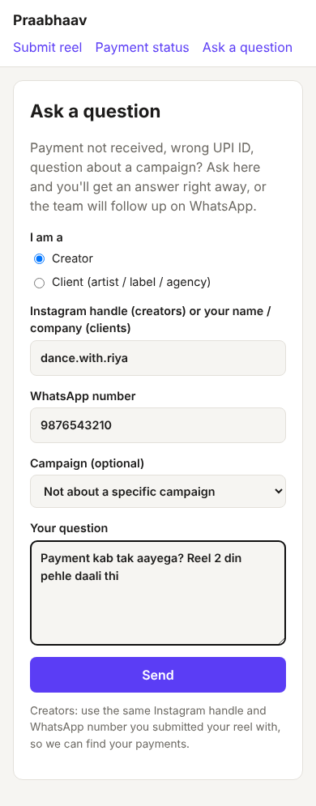
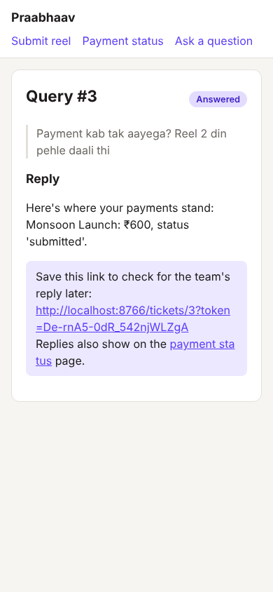
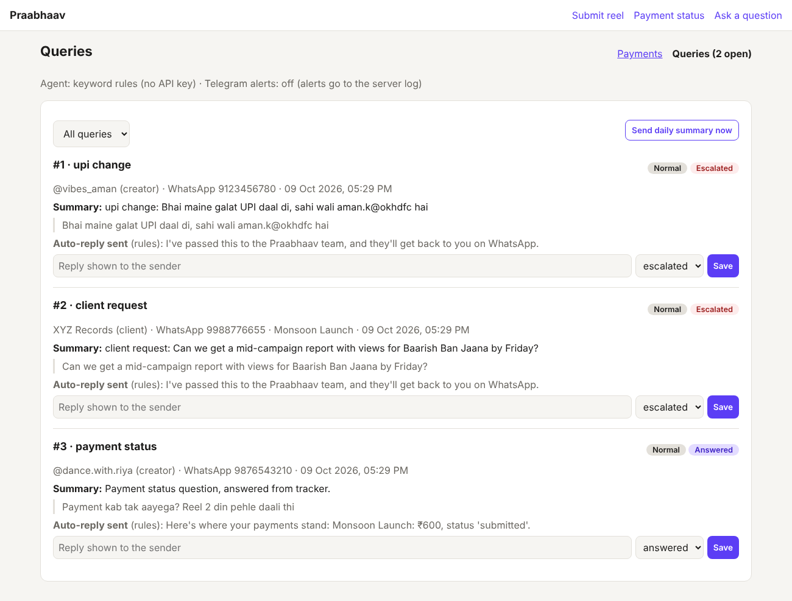
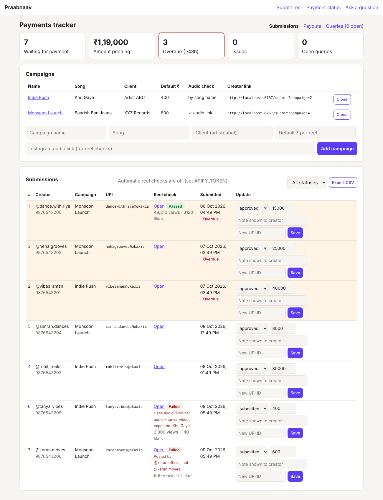
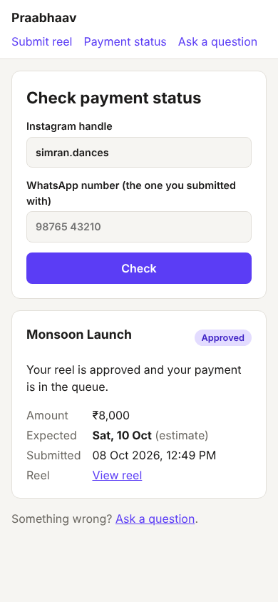

# Praabhaav Creator Payments

An operations app for Praabhaav, a music marketing company. Creators post reels on a client's song and get paid over UPI. This app records every creator, reel and payment in one place. It **checks each reel automatically** (live? right creator? right song?) and **plans payouts around the daily UPI limit**, so every creator sees an expected payment date. A Claude-powered agent answers creator and client queries and escalates anything that needs a human to the core team on Telegram.

See [Roadmap](#roadmap) for what's built and what's next.

| Creator: submit reel | Creator: check status | Team: payments tracker |
|---|---|---|
|  |  |  |

| Ask a question | Instant answer from the tracker | Team: escalated queries |
|---|---|---|
|  |  |  |

| Team: payment planner | Team: automatic reel checks | Creator: expected payment date |
|---|---|---|
|  |  |  |

## What it does

**For creators (mobile-first, no login):**
- `/submit?campaign=<id>`: submit a reel link, Instagram handle, WhatsApp number and UPI ID (entered twice to catch typos). Send this link on WhatsApp once a creator agrees to a campaign.
- `/status`: enter IG handle + WhatsApp number to see status, amount and any note from the team. Both must match, so nobody can look up someone else's payments.

**For the team (`/admin`, password protected):**
- Create campaigns with a default ₹ per reel; close them when done.
- See every submission with status `submitted → approved → scheduled → paid` (or `issue`).
- Change status, adjust the amount per creator, and leave a note that the creator sees.
- Dashboard: number waiting for payment, ₹ pending, **overdue (>48h)** and issues. Overdue rows are highlighted.
- **Export CSV** (e.g. all `approved`) to pay in bulk or upload to a payout tool.

**Query agent (`/query`, Phase 2):**
- Creators and clients ask a question in a form (link it from your Instagram bio and WhatsApp replies).
- The agent ([`app/agent.py`](app/agent.py)) gives Claude **only that sender's own records** plus the FAQ ([`app/knowledge/faq.md`](app/knowledge/faq.md)). Claude classifies the query, writes a reply, and writes a one-line summary for the team. Common questions like "when will I be paid?" get an instant, data-backed answer.
- **Fixed escalation rules in code**, which the model can't override: client queries, UPI changes, amount disputes, overdue payments (>48h) and creators with no records always go to a human. The agent never changes payments; it only reads and replies.
- Escalations send a **Telegram alert** to the core team. `/admin/tickets` lists open queries by priority; the team's reply shows on the sender's ticket link and on the creator's status page.
- **Daily summary** (pending ₹, overdue creators, open queries) sent to Telegram: `python -m app.digest` on a schedule, or the button in `/admin/tickets`.
- Works without keys: no `ANTHROPIC_API_KEY` means keyword rules instead of Claude, and no Telegram config means alerts are written to the server log.

**Reel verification (Phase 3):**
- When adding a campaign, paste the song's **Instagram audio link** (open the song on Instagram → copy link, e.g. `instagram.com/reels/audio/123…`). Without it, the check matches the song name instead, which is less exact.
- [`app/reels.py`](app/reels.py) fetches every `submitted` reel through the [Apify Instagram Reel Scraper](https://apify.com/apify/instagram-reel-scraper) (one run per 20 reels, about $0.003 per reel) and checks: the reel exists, it was **posted by the creator who submitted it**, and it **uses the campaign audio**.
- Passing reels are **approved automatically**, which puts them in the payment queue. Failing reels are **never rejected automatically**: they stay `submitted` with the reasons shown in admin (e.g. "Posted by @karan.official, not @karan.moves"), and the team gets one Telegram summary.
- Views, likes and comments are saved, ready for client reports.
- Run on a schedule (`python -m app.reels`) or with **Check pending reels now** in admin.

**Payment planner (`/admin/payouts`, Phase 3):**
- Set the daily UPI limit (default ₹1,00,000). The planner fills each day **strictly oldest-first**, the order the FAQ promises, counting what's already been paid today.
- Today's batch shows creator, UPI ID and amount: pay them, untick any that failed, then **Mark ticked as paid**. Download it as CSV for bulk payout tools.
- Upcoming days show who gets paid when. A payment bigger than the whole daily limit is flagged so you can split it or pay by bank transfer.
- Every creator sees an **expected payment date** on the status page, and the query agent uses it, so "when will I be paid?" gets a real date.
- The daily summary includes today's batch and when the queue clears.

**Validation built in:** Indian mobile numbers (accepts `+91`, spaces, leading 0), UPI ID format, Instagram reel links (tracking params stripped), and one submission per creator per campaign.

## Run it locally

```bash
cd praabhaav
python -m venv .venv && source .venv/bin/activate
pip install -r requirements-dev.txt

export ADMIN_PASSWORD=change-me      # admin is disabled until this is set
export ADMIN_USER=admin              # optional, defaults to "admin"
export PRAABHAAV_DB=praabhaav.db     # optional, SQLite file path
export ANTHROPIC_API_KEY=...         # optional, enables the Claude query agent
export TELEGRAM_BOT_TOKEN=...        # optional, escalation alerts + daily summary
export TELEGRAM_CHAT_ID=...
export APIFY_TOKEN=...               # optional, automatic reel checks

uvicorn app.main:create_app --factory --reload
```

Open http://localhost:8000/admin, create a campaign, then copy its creator link. All settings are listed in [`.env.example`](.env.example).

**Telegram setup:** message [@BotFather](https://t.me/BotFather), send `/newbot`, and copy the token. Send your new bot any message, then open `https://api.telegram.org/bot<TOKEN>/getUpdates` and copy `chat.id`. To alert the whole team, add the bot to a group and use the group's id.

**Daily summary at 9:30 IST** (cron on the server, or a scheduled job on your host):

```
30 9 * * *    cd /path/to/praabhaav && python -m app.digest
*/30 * * * *  cd /path/to/praabhaav && python -m app.reels    # reel checks every 30 min
```

**Apify setup:** create a free account at apify.com, then copy your API token from Settings → API & Integrations. Checks cost about $0.003 per reel (see Apify's pricing page for your plan).

Run tests:

```bash
python -m pytest -q
```

## Project layout

```
app/
  main.py         routes: creator pages, queries, admin, CSV export
  db.py           SQLite schema and queries (the single source of truth)
  agent.py        query agent: Claude call, fallback rules, escalation policy
  notify.py       Telegram alerts
  digest.py       daily summary
  reels.py        reel verification via Apify
  planner.py      payout planner (daily UPI limit, oldest-first)
  knowledge/faq.md  what the agent is allowed to tell people (edit this)
  validation.py   cleaning/validation of phone, UPI, IG handle, reel URL
  templates/      Jinja2 HTML pages
  static/         CSS
tests/            pytest suite
```

## Before using with real creators

- Deploy behind **HTTPS** (e.g. Render, Railway, or a small VPS with Caddy). UPI IDs and phone numbers are personal data.
- Use a long random `ADMIN_PASSWORD`.
- Back up the `.db` file regularly (or move to Postgres / Google Sheets sync in Phase 2).
- Edit `app/knowledge/faq.md` so it states your real payment policy. The agent only repeats what's written there.
- The query form has no rate limit or captcha yet; add one if spam shows up.
- Admin uses HTTP Basic auth and has no CSRF protection; fine for a small internal team, but replace it with proper login sessions before adding more staff.

## Roadmap

1. **Tracker + submission form + status page**: ✅
2. **Query agent + Telegram escalation + daily summary**: ✅
3. **Reel verification + payment planner**: ✅
4. **Chat front-ends**: WhatsApp / Instagram DM bot on top of the same backend.
5. **Client reports**: per-campaign views/likes report for artists and labels (the data is already collected by the reel checks).
6. **Payout API**: pay today's batch through RazorpayX / Cashfree Payouts instead of manual UPI, removing the daily limit problem at the source.
