# StudyFlow

**Turn your syllabus into a study plan that adapts, quizzes you, and tells you the truth about your progress.**

Paste your syllabus (or upload the PDF), set your exam date and daily hours, and StudyFlow builds a day-by-day plan with spaced revision. When you miss a day, it re-plans automatically. When you finish a topic, Claude writes a 10-question quiz checked against the web. Every week, it gives you a blunt review built from your real numbers.

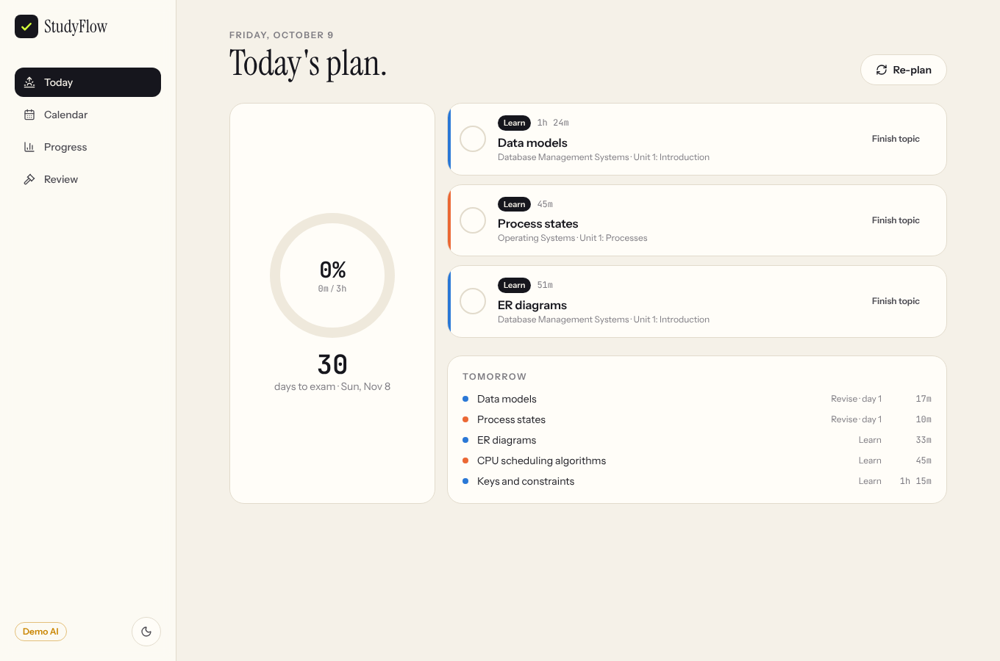

---

## Features

| | |
|---|---|
| **Syllabus → structure** | Paste text or upload a PDF. Claude splits it into subjects → units → topics with difficulty and time estimates. Edit anything before you commit. Scanned PDFs are read directly by Claude. |
| **Adaptive scheduler** | Day-by-day plan to the exam. Weighted by topic difficulty and how weak you are in each subject. Spaced-repetition revisions at +1, +3 and +7 days, a buffer day every week, and final-revision days before the exam. |
| **Auto re-plan** | Miss a day and the next time you open the app, missed sessions are marked and everything left is rescheduled from today. Finish a topic early and the rest of the plan rebalances. |
| **Topic quizzes** | 10 MCQs per topic (4 easy, 4 medium, 2 hard), researched with Claude's web search tool, with explanations and sources after you submit. |
| **Performance tracker** | Syllabus completion, streak, quiz accuracy per subject and difficulty, planned-vs-actual study time, and an auto-generated weak-topic list. |
| **Blunt weekly review** | *"You skipped 3 of 5 DBMS sessions and scored 40% on Joins. Fix this first."* Specific findings from your real stats plus exactly 3 actions for the week. |
| **Design** | Dark/light mode, mobile-first layout, animated progress rings, self-drawing checkmarks, smooth page transitions. Respects `prefers-reduced-motion`. |

## Screenshots

| | |
|---|---|
| 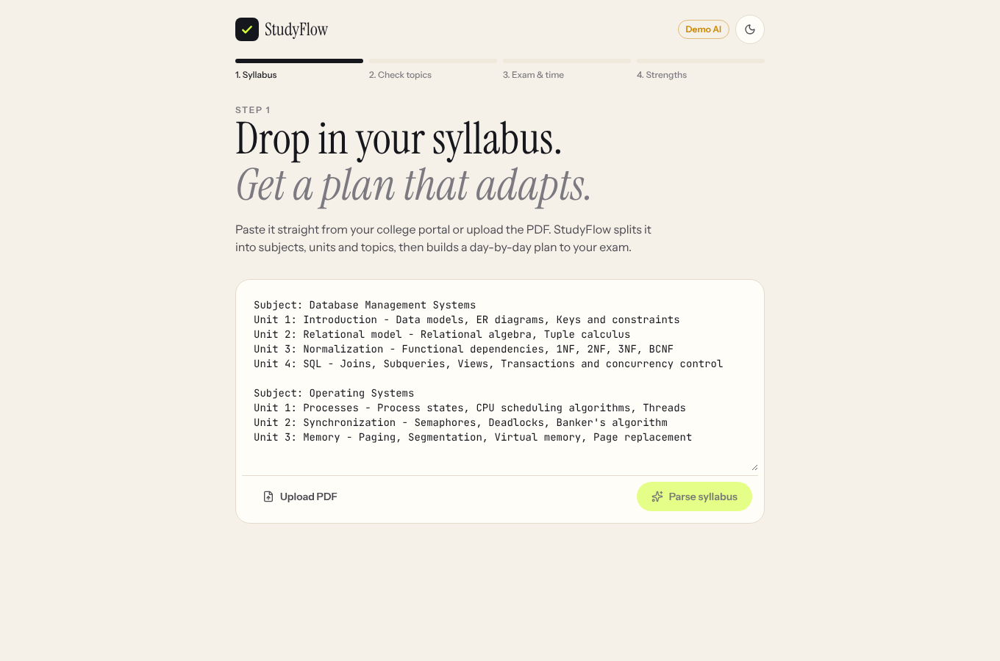 | 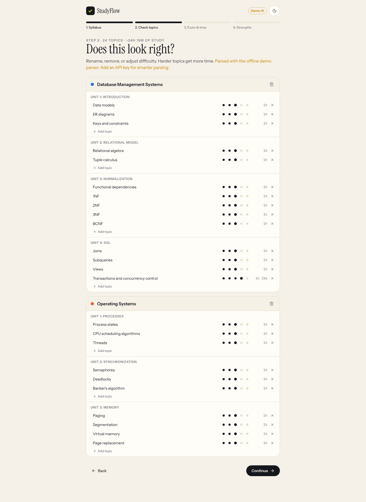 |
| *Paste or upload a syllabus* | *Review and edit the parsed structure* |
| 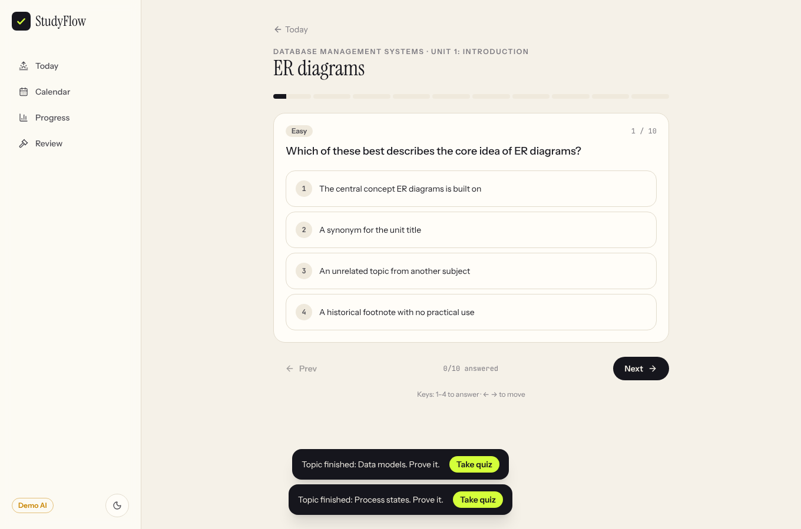 | 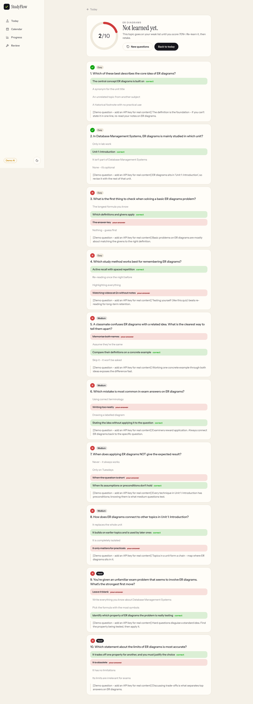 |
| *Topic quiz* | *Results with explanations* |
| 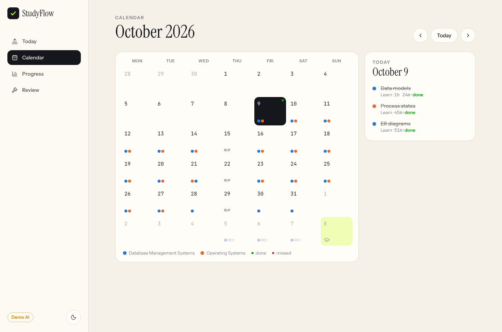 | 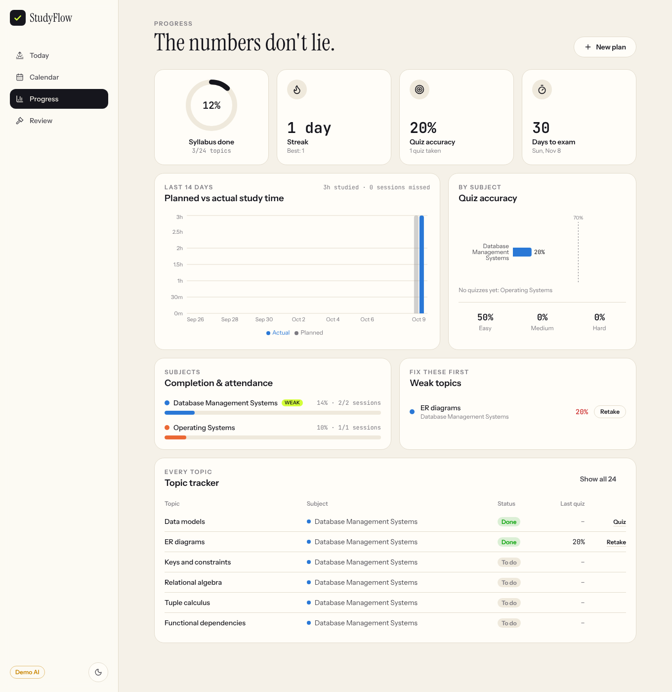 |
| *Calendar* | *Progress dashboard* |
| 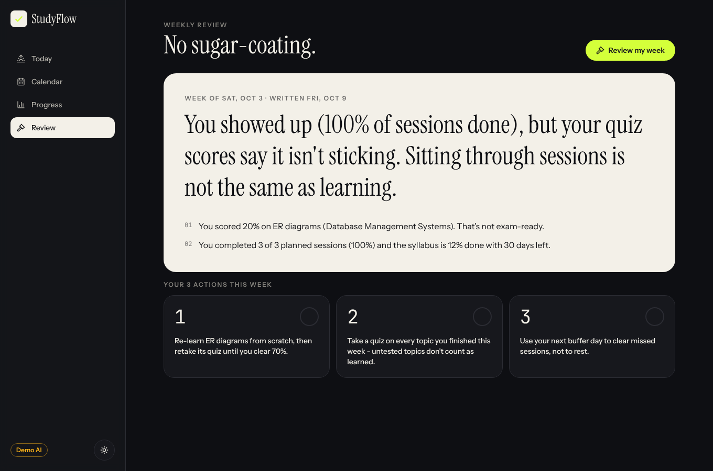 | 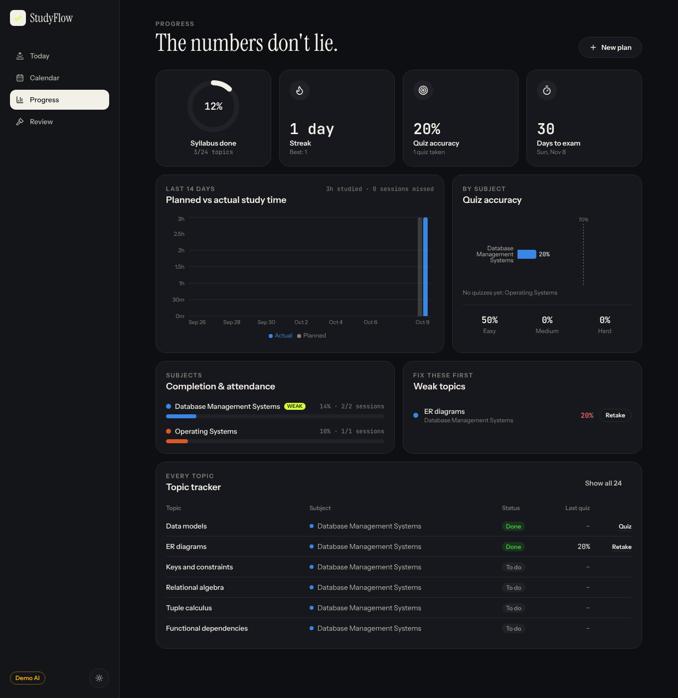 |
| *Weekly review (dark mode)* | *Dashboard (dark mode)* |

<p>
  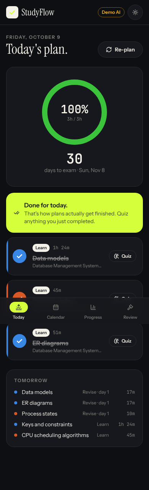
  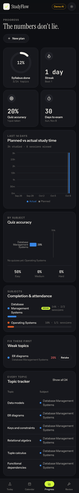
</p>

> 📸 **Placeholder:** add a GIF of the check-off animation here → `docs/screenshots/demo.gif`

---

## Quick start

**Requirements:** Python 3.10+ and Node.js 18+.

```bash
cd studyflow
npm run setup     # one time: creates the Python venv, installs everything, creates .env
npm run dev       # starts backend + frontend together
```

Open **http://localhost:5173**. The API docs are at http://localhost:8000/docs.

### Add your Claude API key (optional)

The app runs fully **without a key** in *Demo AI* mode: a heuristic syllabus parser, template quizzes and a rule-based review. For the real AI features:

1. Get a key at [console.anthropic.com](https://console.anthropic.com/).
2. Put it in `studyflow/.env`:
   ```env
   ANTHROPIC_API_KEY=sk-ant-...
   ```
3. Restart `npm run dev`. The orange **Demo AI** badge disappears.

| Variable | Default | Purpose |
|---|---|---|
| `ANTHROPIC_API_KEY` | *(empty)* | Your key. Never commit it. `.env` is git-ignored. |
| `CLAUDE_MODEL` | `claude-opus-5-5` | Use `claude-sonnet-5-5` or `claude-haiku-5-5` to cut cost. |
| `AI_MOCK` | `false` | Force demo mode even when a key is set. |
| `AI_FALLBACKS` | `true` | Server-side refusal fallback (Claude API only). |
| `DATABASE_URL` | `backend/studyflow.db` | SQLite file location. |

### Other commands

```bash
npm test          # backend test suite (40 tests, no API key or network needed)
npm run build     # production build of the frontend
npm start         # serve the built app + API on one port: http://localhost:8000
```

---

## Architecture

```
┌──────────────────────── Browser ────────────────────────┐
│ React 19 + Vite + Tailwind v4 + Framer Motion + Recharts│
│ TanStack Query for server state · React Router          │
└──────────────────────────┬──────────────────────────────┘
                           │ JSON /api  (Vite proxy in dev)
┌──────────────────────────▼──────────────────────────────┐
│ FastAPI                                                 │
│  routers/   syllabus · plan · quiz · stats              │
│  services/                                              │
│   ├ scheduler.py  pure, deterministic planning algorithm│
│   ├ planning.py   DB side: create plan, re-plan, ticks  │
│   ├ stats.py      every dashboard / review number       │
│   └ ai/  client · schemas · syllabus · quiz · review    │
│          · mock (offline demo)                          │
│  SQLAlchemy 2 → SQLite                                  │
└──────────────────────────┬──────────────────────────────┘
                           │ Anthropic Python SDK
                       Claude API (key from .env)
```

### Design decisions

- **The scheduler is not AI.** Planning is a deterministic algorithm in `backend/app/services/scheduler.py`. It's free, instant, explainable and unit-tested. Claude handles what needs language understanding: parsing, quiz writing and the review.
- **AI output is never trusted blindly.** Every response is validated against a Pydantic contract (`services/ai/schemas.py`): exactly 10 questions with a 4/4/2 difficulty mix, 4 distinct options, a valid answer index, and exactly 3 review actions. If validation fails, the error is sent back to Claude for **one repair attempt** with structured outputs enforced. If that also fails, the user gets a clean error message rather than corrupted data.
- **Structured outputs + web search.** Syllabus parsing and reviews use JSON-schema structured outputs. Quizzes use the web search tool, so their JSON is validated afterwards.
- **Demo mode.** Without a key, the AI services fall back to offline implementations, so the app always runs and the tests never spend money.

### Scheduling algorithm

1. **Calendar:** today → the day before the exam. The last ~10% of days are final revision. Every 7th day is a buffer.
2. **Weighting:** `minutes = estimate × difficulty factor (0.8–1.4) × strength factor (weak 1.4 / okay 1.0 / strong 0.75)`.
3. **Packing:** each day fills revisions due first, then new topics, interleaved round-robin across subjects with weak subjects leading. Long topics split across days (no chunks under 15 min).
4. **Spaced repetition:** when a topic's last chunk lands on day D, revisions are queued for D+1, D+3 and D+7.
5. **Overload:** if the work doesn't fit, sessions shrink proportionally and the UI shows the daily time you'd actually need.
6. **Re-plan:** past pending sessions → `missed`. Future pending sessions are rebuilt from today using progress so far, and minutes already studied today count against today's capacity. Re-planning is idempotent.

### Database schema

```
plans          id, exam_date, daily_minutes, is_active, version, required_daily_minutes
subjects       id, plan_id→, name, strength(weak|neutral|strong), color, position
units          id, subject_id→, name, position
topics         id, unit_id→, name, difficulty(1-5), est_minutes, status(pending|done), completed_at
schedule_items id, plan_id→, date, topic_id→, kind(learn|revise|buffer|final_revision),
               rev_interval, minutes, status(pending|done|missed), plan_version, completed_at
quizzes        id, topic_id→, score, total, sources(JSON), created_at, submitted_at
questions      id, quiz_id→, position, difficulty, stem, options(JSON), correct_index,
               explanation, chosen_index
reviews        id, plan_id→, week_start, stats(JSON), verdict, findings(JSON), actions(JSON)
```

Streak, completion %, planned-vs-actual and weak topics are all derived from `schedule_items` and `questions`, so there are no duplicated counters to drift out of sync.

### Project structure

```
studyflow/
├── package.json            npm run setup | dev | test | build | start
├── .env.example
├── scripts/                cross-platform runners (Windows/macOS/Linux)
├── backend/
│   ├── requirements.txt
│   ├── app/
│   │   ├── main.py  config.py  db.py  models.py  schemas.py  serializers.py  deps.py
│   │   ├── routers/        syllabus.py  plan.py  quiz.py  stats.py
│   │   └── services/       scheduler.py  planning.py  stats.py  pdf.py
│   │       └── ai/         client.py  schemas.py  syllabus.py  quiz.py  review.py  mock.py
│   └── tests/              scheduler · API flows · AI validation · live-path (stub server)
├── frontend/
│   └── src/
│       ├── components/     Layout  ProgressRing  CheckButton  ui
│       ├── pages/          Setup  Today  Calendar  Quiz  Dashboard  Review
│       └── lib/            api.ts  format.ts
└── docs/screenshots/
```

## API

| Method | Path | Description |
|---|---|---|
| `POST` | `/api/syllabus/parse` | Text → subjects/units/topics (preview, not saved) |
| `POST` | `/api/syllabus/parse-pdf` | PDF upload → same |
| `POST` | `/api/plans` | Save the structure + exam date + hours → builds the schedule |
| `GET` | `/api/plans/active` | Current plan |
| `POST` | `/api/plans/active/replan` | Rebuild from today |
| `GET` | `/api/schedule/today` | Today + tomorrow (auto re-plans missed days first) |
| `GET` | `/api/schedule?from=&to=` | Calendar range |
| `PATCH` | `/api/schedule/{id}` | Mark a session done / undone |
| `POST` | `/api/topics/{id}/complete` | Finish a topic early → re-plan |
| `POST` | `/api/quizzes` | Generate a quiz for a topic (answers hidden) |
| `POST` | `/api/quizzes/{id}/submit` | Grade it → score, explanations, sources |
| `GET` | `/api/stats` | Everything on the dashboard |
| `POST` / `GET` | `/api/reviews` | Generate / list weekly reviews |

Interactive docs: http://localhost:8000/docs

## Testing

```bash
npm test
```

- `test_scheduler.py`: capacity limits, interleaving, revision intervals, buffer and final days, overload handling.
- `test_api.py`: the full user flow including a simulated missed day, re-plan idempotency, quiz flow and review.
- `test_ai_validation.py`: the AI output contract rejects bad quizzes and reviews. Also covers the demo parser.
- `test_ai_live_path.py`: runs the **real Anthropic SDK** against a local stub server to check the request shapes (structured output, web search tool, refusal handling, the `pause_turn` resume, validate → retry).

## Deploying

`npm start` serves the frontend and API from one port, so any host that runs Python + Node works (Render, Railway, Fly.io, a VPS):

- **Build command:** `npm run setup && npm run build`
- **Start command:** `HOST=0.0.0.0 npm start`
- Set `ANTHROPIC_API_KEY` in the host's environment settings, not in a committed file.
- SQLite lives on local disk. On hosts with ephemeral disks, attach a persistent volume or point `DATABASE_URL` at it.

## Roadmap

- [ ] Accounts / multi-user (the schema already isolates data per plan)
- [ ] Export plan to Google Calendar (.ics)
- [ ] Pomodoro timer inside a session
- [ ] Re-weight topics automatically from quiz accuracy

## License

MIT
